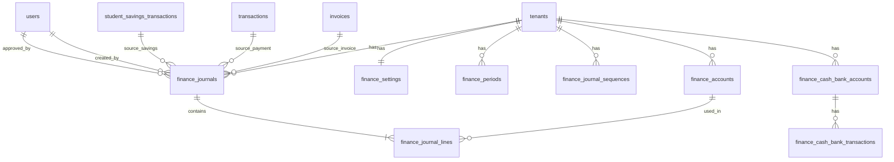

# Finance Blueprint (Integrated Accounting)

Dokumen ini adalah rancangan implementasi fitur finance end-to-end yang terintegrasi dengan modul yang sudah ada di aplikasi:
- Tagihan siswa (`FeeType`, `Invoice`, `Transaction`)
- Tabungan santri (`StudentSavingsAccount`, `StudentSavingsTransaction`)
- Multi tenant (`tenant_id`)

## 1) Target Scope

Fitur yang dicakup:
1. Pencatatan kas dan bank (uang masuk/keluar umum, bukan hanya kasir siswa).
2. Jurnal umum double-entry.
3. Buku besar + neraca saldo.
4. Laporan keuangan dasar: Laba Rugi, Neraca Posisi Keuangan, Arus Kas (metode tidak langsung bisa menyusul).
5. Periode akuntansi + lock period (tutup buku bulanan).

## 2) ERD (Logical)



## 3) Tabel Baru (Minimum Viable Accounting)

### 3.1 `finance_accounts`
Chart of Accounts per tenant.
- `id`, `tenant_id`
- `code` (varchar 20, unique per tenant)
- `name` (varchar 120)
- `category` (`ASSET`, `LIABILITY`, `EQUITY`, `REVENUE`, `EXPENSE`)
- `normal_balance` (`DEBIT`, `CREDIT`)
- `parent_id` (nullable, untuk akun turunan)
- `is_active`
- timestamp + soft delete

Constraint:
- unique (`tenant_id`, `code`)
- unique (`tenant_id`, `name`) opsional

### 3.2 `finance_periods`
Periode akuntansi per tenant.
- `id`, `tenant_id`
- `name` (contoh: `2026-05`)
- `start_date`, `end_date`
- `status` (`OPEN`, `CLOSED`, `LOCKED`)
- `closed_at`, `closed_by_user_id`

Constraint:
- unique (`tenant_id`, `name`)
- validasi rentang tanggal tidak overlap (service-level check)

### 3.3 `finance_settings`
Mapping akun default per tenant (strict schema, bukan key-value bebas).
- `id`, `tenant_id`
- `default_cash_bank_account_id`
- `default_spp_revenue_account_id`
- `default_registration_revenue_account_id`
- `default_savings_liability_account_id`
- `default_donation_revenue_account_id`
- timestamp + soft delete

Constraint:
- unique (`tenant_id`)
- semua FK harus milik tenant yang sama

### 3.4 `finance_journal_sequences`
Counter nomor jurnal yang aman dari race condition.
- `id`, `tenant_id`
- `year_month` (format `YYYY-MM`, contoh `2026-05`)
- `last_value` (integer)
- timestamp

Constraint:
- unique (`tenant_id`, `year_month`)

Catatan implementasi:
- nomor jurnal format: `JV-YYYY-MM-XXXX`
- generator wajib lock row sequence (`SELECT ... FOR UPDATE`) dalam satu transaction
- jika row bulan belum ada: insert `last_value=0`, lock, lalu increment

### 3.5 `finance_journals`
Header jurnal.
- `id`, `tenant_id`
- `journal_no` (unique per tenant)
- `journal_date`
- `description`
- `source_type` (contoh: `INVOICE_PAYMENT`, `SAVINGS_DEPOSIT`, `SAVINGS_WITHDRAWAL`, `CASH_IN`, `CASH_OUT`, `ADJUSTMENT`)
- `source_id` (id data asal)
- `status` (`DRAFT`, `POSTED`, `VOID`)
- `created_by_user_id`, `approved_by_user_id` (nullable)
- `posted_at`, `voided_at`, `void_reason`

Constraint:
- unique (`tenant_id`, `journal_no`)
- unique (`tenant_id`, `source_type`, `source_id`) untuk cegah double-posting

### 3.6 `finance_journal_lines`
Detail debit/credit.
- `id`, `tenant_id`
- `journal_id`
- `account_id`
- `entry_side` (`DEBIT`, `CREDIT`)
- `amount` (integer rupiah)
- `memo` (nullable)
- `reference_type`, `reference_id` (nullable)

Constraint:
- `amount > 0`
- check keseimbangan debit==credit dilakukan service-level (wajib sebelum `POSTED`)

### 3.7 `finance_cash_bank_accounts`
Daftar kas dan rekening bank.
- `id`, `tenant_id`
- `account_name` (contoh: `Kas Operasional`, `BCA 1234`)
- `account_type` (`CASH`, `BANK`, `EWALLET`)
- `gl_account_id` (FK ke `finance_accounts`)
- `is_active`

Constraint:
- unique (`tenant_id`, `account_name`)
- `gl_account_id` wajib akun kategori `ASSET`

### 3.8 `finance_cash_bank_transactions`
Sub-ledger kas/bank umum.
- `id`, `tenant_id`
- `cash_bank_account_id`
- `trx_date`
- `trx_type` (`IN`, `OUT`, `TRANSFER`)
- `amount`
- `counterpart_account_id` (FK ke `finance_accounts`)
- `description`
- `journal_id` (FK ke `finance_journals`, nullable saat draft)
- `status` (`DRAFT`, `POSTED`, `VOID`)
- `created_by_user_id`, `approved_by_user_id`

## 4) Mapping Integrasi Modul Existing

Sumber transaksi yang sudah ada:
1. Pembayaran invoice siswa (`Transaction`).
2. Topup tabungan santri (`StudentSavingsTransaction` tipe `DEPOSIT`).
3. Penarikan tabungan santri (`StudentSavingsTransaction` tipe `WITHDRAWAL`).

Keputusan basis untuk MVP:
- gunakan **cash basis**.
- `Invoice` tidak membuat jurnal saat terbit.
- jurnal hanya dibuat saat kas/bank benar-benar bergerak (pembayaran diterima atau pengeluaran terjadi).

Aturan posting awal:
1. Invoice payment:
   - Dr Kas/Bank
   - Cr Pendapatan Pendidikan
2. Savings deposit:
   - Dr Kas/Bank
   - Cr Utang Titipan Tabungan Santri
3. Savings withdrawal:
   - Dr Utang Titipan Tabungan Santri
   - Cr Kas

Catatan:
- Akun default diambil dari `finance_settings` per tenant.
- Jika akun map belum diatur, transaksi tetap jalan tapi jurnal disimpan `DRAFT` + warning di dashboard finance.

## 5) Kontrak Service (Python)

Tambahkan service baru: `app/services/finance_posting_service.py`.

```python
def post_invoice_payment(*, tenant_id: int, transaction_id: int, actor_user_id: int) -> int:
    """Return journal_id, idempotent by (source_type, source_id)."""

def post_savings_transaction(*, tenant_id: int, savings_transaction_id: int, actor_user_id: int) -> int:
    """Handle DEPOSIT and WITHDRAWAL, only for approved transaction."""

def create_cash_bank_transaction(
    *, tenant_id: int, trx_date, cash_bank_account_id: int, trx_type: str,
    amount: int, counterpart_account_id: int, description: str, actor_user_id: int
) -> int:
    """Create sub-ledger cash/bank and post journal immediately if period open."""

def post_journal(*, tenant_id: int, journal_id: int, actor_user_id: int) -> None:
    """Validate balance and period status, then set status POSTED."""

def reverse_journal(*, tenant_id: int, journal_id: int, reason: str, actor_user_id: int) -> int:
    """Create reversal journal, never hard delete."""

def generate_journal_no(*, tenant_id: int, journal_date) -> str:
    """Generate JV-YYYY-MM-XXXX with row lock on finance_journal_sequences."""
```

Prinsip penting:
- Idempotent: panggil ulang tidak boleh bikin jurnal dobel.
- Transaction-safe: gunakan DB transaction + `with_for_update()` saat update saldo/source.
- Tenant-safe: semua query by `tenant_id`.
- Immutable posted journal: jurnal `POSTED` tidak boleh di-edit/hard-delete.

## 6) Titik Integrasi Kode Saat Ini

1. Setelah `db.session.commit()` sukses di kasir:
   - `app/routes/staff.py` pada flow `cashier_pay`.
   - panggil `post_invoice_payment(...)`.
2. Saat approval tabungan `DEPOSIT/WITHDRAWAL` di asrama:
   - `app/routes/boarding.py` pada flow `manage_savings`.
   - panggil `post_savings_transaction(...)`.
3. Buat menu baru admin:
   - `/admin/keuangan/akun`, `/admin/keuangan/jurnal`, `/admin/keuangan/kas-bank`, `/admin/keuangan/laporan`.

## 7) Reconciliation Dashboard (Wajib Production)

Tambahkan halaman `/admin/keuangan/rekonsiliasi-posting` dengan indikator:
1. `Transaction` kasir sukses, tapi belum ada `finance_journals` `POSTED`.
2. `StudentSavingsTransaction` `APPROVED`, tapi belum ada jurnal `POSTED`.
3. Jurnal `DRAFT` karena mapping akun default belum lengkap (`finance_settings` kosong/invalid).
4. Jurnal gagal posting karena periode belum tersedia/closed.

Aksi cepat di dashboard:
1. tombol `retry posting` per baris.
2. bulk retry per jenis sumber.
3. link langsung ke form `finance_settings`.

## 8) Urutan Migration Alembic (Recommended)

1. `add_finance_accounts_and_periods.py`
2. `add_finance_settings.py`
3. `add_finance_journal_sequences.py`
4. `add_finance_journals_and_lines.py`
5. `add_finance_cash_bank_accounts.py`
6. `add_finance_cash_bank_transactions.py`
7. `add_finance_source_unique_index.py` (idempotency index)
8. `seed_default_coa_per_tenant.py` (data migration script)
9. `seed_finance_settings_defaults.py` (map akun default per tenant)

## 9) COA Starter (Sekolah/Organisasi)

Minimal akun yang perlu:
- 1010 Kas Operasional
- 1020 Bank Operasional
- 1100 Piutang SPP
- 2010 Utang Titipan Tabungan Santri
- 3100 Modal/Saldo Awal
- 4100 Pendapatan SPP
- 4200 Pendapatan Pendaftaran
- 4300 Pendapatan Donasi/Infaq
- 5100 Beban Gaji
- 5200 Beban ATK
- 5300 Beban Utilitas

## 10) UI Prioritas

Phase cepat go-live:
1. Master akun (COA) + kas/bank account mapping.
2. Kas/Bank transaction form (IN/OUT/TRANSFER).
3. Jurnal umum list + detail + filter periode + export.
4. Laporan:
   - Buku besar
   - Neraca saldo
   - Laba rugi
   - Neraca
5. Reconciliation dashboard posting.

## 11) Test Matrix (Minimal)

1. Double posting guard:
   - sumber transaksi sama tidak membuat jurnal kedua.
2. Balance validation:
   - jurnal unbalanced ditolak `POSTED`.
3. Tenant isolation:
   - tenant A tidak bisa akses data tenant B.
4. Closed period guard:
   - posting tanggal periode closed harus gagal.
5. Reversal:
   - void lewat reversal menjaga jejak audit.
6. Journal number race:
   - 2 request bersamaan menghasilkan nomor unik berurutan.
7. Immutability:
   - jurnal `POSTED` tidak bisa diubah/hard-delete.

## 12) Data Integrity Rules (Non-Negotiable)

1. Tidak boleh hard delete jurnal `POSTED`.
2. Koreksi hanya dengan reversal journal.
3. Edit jurnal hanya boleh saat status `DRAFT`.
4. Semua endpoint delete finance harus berubah menjadi `void` / `reverse`.

## 13) Definition of Done (Finance Core)

Sebuah tenant dianggap selesai fase finance core jika:
1. Semua pembayaran kasir otomatis punya jurnal `POSTED`.
2. Semua transaksi tabungan approved otomatis punya jurnal `POSTED`.
3. Admin bisa input kas/bank IN/OUT/TRANSFER dan terposting.
4. Laporan neraca saldo dan laba rugi bisa dihasilkan per periode.
5. Periode bisa ditutup, dan transaksi back-date ke periode closed ditolak.
